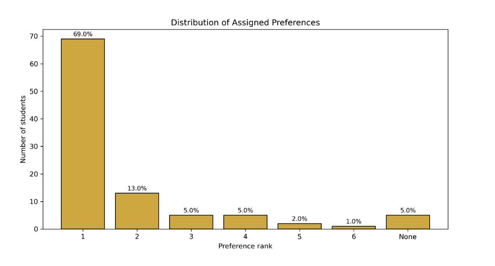
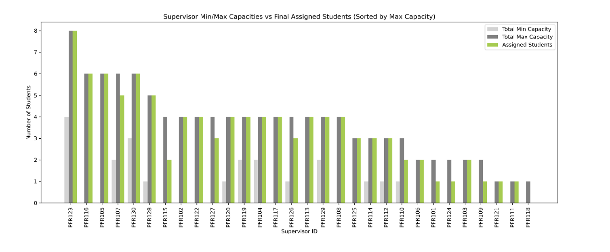
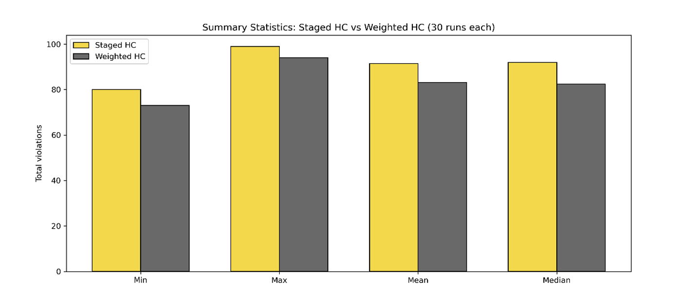
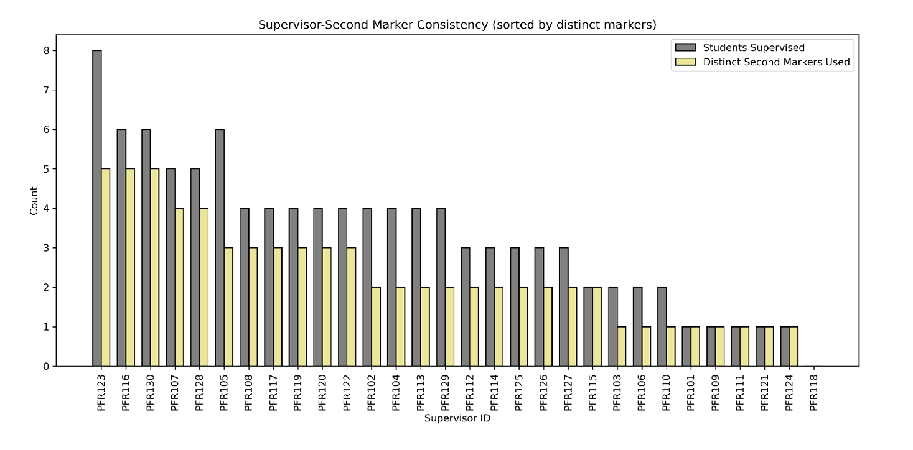

# Student Project Allocation Optimisation using Heuristics & Metaheuristics

This project explores the Student Project Allocation (SPA) problem under realistic university constraints using heuristic and metaheuristic optimisation techniques.

The system allocates:
- students to dissertation projects,
- supervisors to workloads,
- second markers to projects,

while balancing:
- student preferences,
- supervisor capacities,
- eligibility requirements,
- fairness and consistency constraints.

The project compares multiple optimisation strategies including:
- Hill Climbing,
- Hybrid Local Search,
- Simulated Annealing,
- Weighted Hill Climbing.

---

# Why This Project Matters

Student project allocation is a real-world combinatorial optimisation problem faced by universities worldwide.

Manual allocation systems are often:
- time-consuming,
- difficult to scale,
- prone to unfair workload distribution,
- challenging to optimise under competing institutional constraints.

This project demonstrates how heuristic and metaheuristic optimisation methods can improve fairness, transparency, and efficiency in academic allocation systems.

---

# Key Results

- 69% of students received their **first-choice project**
- 87% received one of their **top three choices**
- All hard institutional constraints were satisfied
- Hybrid Hill Climbing achieved near-Simulated Annealing performance with significantly lower runtime
- Weighted Hill Climbing achieved the strongest optimisation score overall
- Supervisor workloads remained balanced across allocations
- Second marker duties were distributed while minimising conflicts of interest

---

# Example Visualisations

## Student Preference Satisfaction


## Supervisor Workload Balancing


## Algorithm Benchmarking


## Second Marker Consistency


---

# Problem Overview

The optimisation problem was divided into two linked stages:

## 1. Student Project Allocation

Students were assigned to projects while satisfying:
- project capacities,
- supervisor workload constraints,
- prerequisites,
- minimum grade requirements,
- client-project eligibility,
- student preferences.

## 2. Second Marker Allocation

Second markers were assigned while ensuring:
- no supervisor marked their own students,
- second-marking duties remained balanced,
- consistency across supervisor project groups.

---

# Algorithms Implemented

## Staged Hill Climbing

A transparent staged framework that enforces hard constraints before optimising softer objectives such as preference satisfaction.

## Hybrid Local Search

Combines multiple neighbourhood operators dynamically during optimisation to improve robustness and search diversity.

## Simulated Annealing

Extends Hill Climbing through probabilistic acceptance of worse moves to escape local optima.

## Weighted Hill Climbing

Optimises a single weighted objective function to achieve stronger global performance.

---

# Neighbourhood Structures

Five custom neighbourhood operators were designed and benchmarked to explore different local search behaviours within the allocation landscape.

| Operator | Purpose |
|---|---|
| **N1 – Single Student Reassignment** | Reassigns one student to another feasible preferred project |
| **N2 – Supervisor Portfolio Rebalancing** | Redistributes students across a supervisor’s project portfolio |
| **N3 – Constraint Violation Repair** | Repairs over-capacity or infeasible allocations |
| **N4 – Project Type Clustering** | Prioritises movement into eligible client-based projects |
| **N5 – Preference Distance Minimisation** | Swaps students to reduce preference dissatisfaction |

These operators were benchmarked across multiple datasets and stochastic runs to evaluate:
- optimisation quality,
- runtime efficiency,
- robustness,
- scalability.

Results showed that neighbourhood choice had limited impact on final allocation quality, although runtime differences were substantial.

---

# Benchmarking & Evaluation

The optimisation framework was evaluated using:
- multiple synthetic datasets,
- varying constraint difficulty,
- repeated stochastic experiments,
- runtime and violation metrics.

Key findings:
- allocation quality was relatively stable across neighbourhoods,
- hybrid approaches improved robustness,
- Simulated Annealing offered marginal gains at significantly higher computational cost,
- weighted optimisation achieved the strongest performance but reduced transparency due to subjective penalty weights.

---

# Example Results

## Allocation Quality

- 69% first-choice allocation
- 13% second-choice allocation
- Only 5% allocated outside preference lists

## Runtime Comparison

- Hybrid Hill Climbing: ~15 minutes
- Simulated Annealing: ~3 hours
- Weighted Hill Climbing: ~25 minutes

---

# Repository Structure

```text
├── Code/
│   ├── spa_solver.py
│   ├── simulated_annealing.py
│   ├── neighbourhoods.py
│   ├── weighted_solver.py
│   └── second_marker_solver.py
│
├── Data/
│   ├── students.csv
│   ├── projects.csv
│   └── supervisors.csv
│
├── Results/
│   ├── allocations/
│   ├── benchmarking/
│   └── violation_reports/
│
├── Figures/
│   ├── preference_distribution.png
│   ├── supervisor_capacity.png
│   ├── benchmarking.png
│   └── second_marker_consistency.png
│
└── README.md
```

---

# Technologies Used

- Python
- pandas
- NumPy
- Heuristic Optimisation
- Metaheuristics
- Local Search
- Simulated Annealing
- Experimental Benchmarking
- Data Analysis

---

# Future Improvements

Potential extensions include:
- Genetic Algorithms
- Multi-objective optimisation
- Real institutional datasets
- Interactive allocation dashboard
- Fairness-aware optimisation metrics
- Constraint programming approaches

---

# Author

Dena Shirzad

